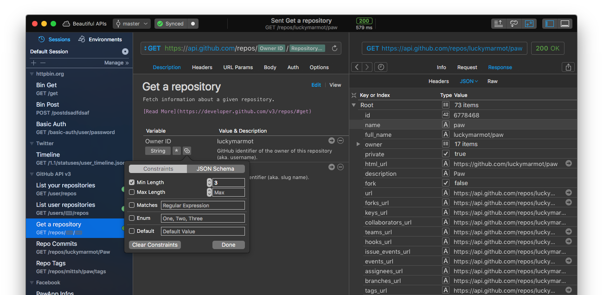

# Paw HTTP Client

**This repository is going to be closed.**

**Paw is now part of [RapidAPI](https://rapidapi.com/).**

If you're using Paw and have found some bugs, please feel free to email at [support@paw.cloud](mailto:support@paw.cloud), or [create an Issue here](https://paw.cloud/support?app=com.luckymarmot.Paw). We'll always appreciate your help. Also, please never hesitate to create an issue for a tiny bug, a UI problem, a keyboard shortcut that you'd love to have, or a feature you'd like to see in the next release.

Every detail count!

Thanks a lot for enjoying Paw and for helping!

[Micha Mazaheri](http://micha.mazaheri.me)

# What is Paw?

Paw is an HTTP Client for Mac, Linux and Windows.

Easily craft your HTTP requests, try them, archive them. Setup HTTP Headers, URL parameters, form-encoded POST key-values or text. Get easy-to-read responses with well formatted headers and body. 

[Learn more about Paw](https://paw.cloud)

* Smart Autocompletion: a rich database of HTTP headers and their most common values, and ads your entry for future completions. 

* Response Formatting: responses are automatically formatted, and colored (JSON, XML, HTML, RSS...). 

* Simply write your URL: Paw colors it to make it more readable, 
and parses the parameters as a key-value table. Or enter parameters in the table, it will add them to the URL. 

* Web & Images display: Compose the most complicated HTTP request and visualize the result like if it was in your browser. It's nice when your server always formats errors in HTML! 

* Copy & paste as cURL: Copy a request from Paw, you can just paste it anywhere as a cURL-formatted request. 

* Keyboard Shortcuts: Don't waste time anymore with mouse, Paw is build with a few easy-to-learn shortcuts to save your time.

# License

Sorry for disappointing you, but Paw is not Open Source :( You can find it on the Mac App Store: [Paw HTTP Client](https://paw.cloud) ...
